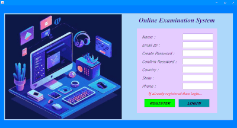
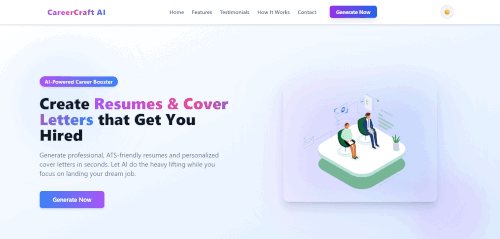

<!-- 🌌 Top Banner -->

  

<!-- ✨ Animated Typing Banner -->

  

---

### 💫 About Me  

> ⚡ *Code like a human, build like a machine.*  
> I’m a **Full Stack Developer** obsessed with **beautiful UI, clean APIs, and creative AI**.  
> I blend **frontend elegance** with **backend logic**, because why choose when you can do both?  

💻 **Tech Stack:** React, Next.js, Node.js, MongoDB, TailwindCSS, Firebase, Python, DevOps  
🌈 **Currently Exploring:** AI-integrated web systems + cloud automation  
🧠 **Goal:** Build stuff that feels futuristic but human  
💬 **Ask me about:** APIs, UI/UX, DevOps, design systems  
🎨 **Fun Fact:** I code better when the playlist hits “synthwave” 🎵  

---

### 🛠️ My Tech Stack & Badges  

  

  
  
  
  
  

---

### 🚀 Featured Projects  

💾 **[QuizCraft](https://github.com/Shreya04-bot/QuizCraft)**  
> A secure, offline exam system using **Java AWT + MySQL**.  
> Smooth registration → quiz-taking → results — no internet, no worries.  
>  
> 

🧭 **[CareerCraft-AI](https://github.com/Shreya04-bot/CareerCraft-AI)**  
> An **AI-powered career guide** that maps user profiles to skills, goals & opportunities.  
> Built with **JavaScript + OpenAI APIs** for personalized insights.  
>  
> 

🔥 **[CodeStreak](https://github.com/Shreya04-bot/CodeStreak)**  
> Helps devs maintain **daily coding streaks** and track problem-solving consistency.  
> Productivity + motivation = unbeatable combo 💪  

🌐 **[PolyGlow](https://github.com/Shreya04-bot/PolyGlow)**  
> A multilingual translator app with **React + Express**.  
> Features speech input/output and theme switching — smooth, dynamic, global.  

🎨 **[Frontend Experiments](https://github.com/Shreya04-bot/Frontend)**  
> My digital sketchbook — UI ideas, animations, layouts.  
> Where design meets code (and a bit of chaos).

---

### 🪩 Connect with Me  

  
  
  

---

### 🏆 Achievements / Trophies  

  

---

### 📊 GitHub Stats & Languages  

  
  

  

---

  

---

### 💬 “Code it. Style it. Ship it. Own it.” 
Made with 💜 by <b>Shreya</b>

---

  

